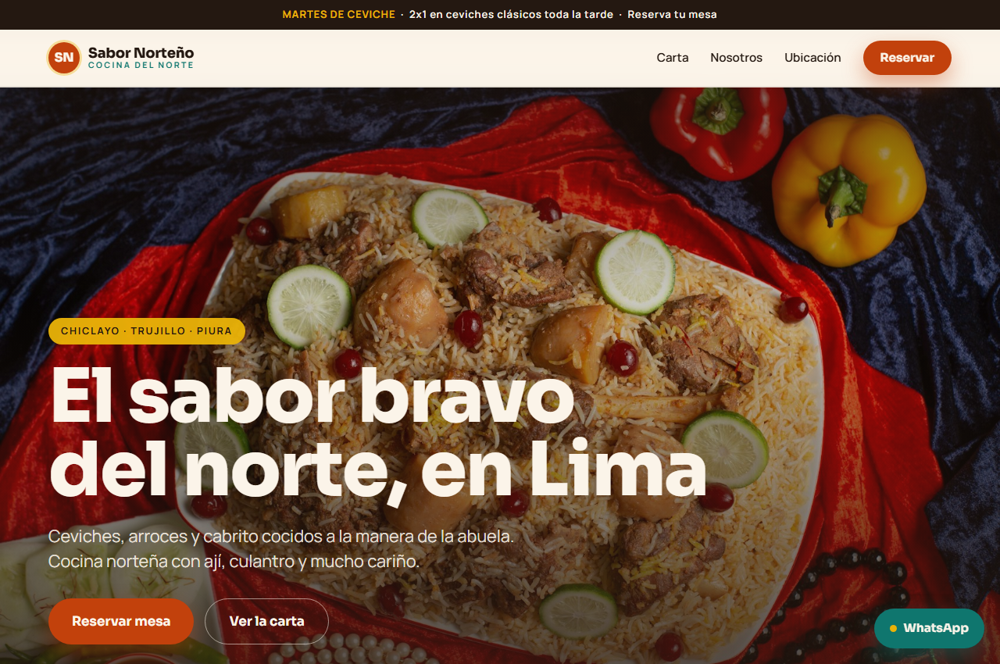

# Sabor Norteño 🇵🇪

Landing page de una sola página para **Sabor Norteño**, un restaurante *ficticio*
de comida norteña peruana (ceviches, arroz con mariscos, cabrito, postres y bebidas).
Proyecto de portafolio para demostrar trabajo visual y comercial front-end.

> Construido como un sitio estático estándar (HTML + CSS + JavaScript puro),
> sin dependencias ni framework.

**Qué resuelve:** le da al restaurante una presencia web profesional que muestra
sus platos con fotos, comunica su propuesta ("el sabor bravo del norte, en Lima")
y facilita las reservas y el contacto por WhatsApp.

---

## 🧰 Tecnologías

- **HTML5** — estructura y contenido semántico.
- **CSS3** — diseño responsivo, variables y animaciones.
- **JavaScript** — interactividad del lado del cliente (menú, filtro, validación).

---

## 🖼️ Captura de pantalla

<!-- Reemplaza la ruta por tu captura, por ejemplo: assets/img/screenshot.png -->


---

## 🌐 Sitio en vivo

<!-- Pega aquí el enlace a la web publicada (GitHub Pages, Netlify, Vercel, etc.) -->
🔗 [Ver web en vivo](https://juniorwilber.github.io/sabor-norteno/)

---

## 📂 Estructura del proyecto

```
comida-norteña/
├── index.html          → Estructura y contenido de la página
├── css/
│   └── styles.css      → Todos los estilos (variables, componentes, responsive)
├── js/
│   └── main.js         → Interactividad (menú, filtro, validación, WhatsApp)
├── assets/
│   └── img/            → Imágenes locales (platos, hero, interior)
└── README.md           → Este archivo
```

---

## ✨ Funcionalidades

- **Menú hamburguesa** a pantalla completa en móvil, accesible con teclado
  (se abre/cierra con el botón, se cierra con `Escape` o al elegir un enlace).
- **Scroll suave** entre secciones (vía CSS `scroll-behavior`, con margen para
  la cabecera fija).
- **Filtro de la carta por categorías** (Todos · Entradas · Platos de fondo ·
  Bebidas · Postres): los botones muestran u ocultan cada bloque. *Es el detalle
  interactivo principal.*
- **WhatsApp**: botón flotante siempre visible + envío del formulario de reserva
  directamente a WhatsApp con los datos ya escritos.
- **Validación del formulario de reserva**: verifica campos vacíos y el formato
  del correo antes de "enviar", con mensajes de error en español.

---

## 🚀 Cómo verlo

No necesita compilación. Basta con abrir `index.html` en el navegador.

Para que las tipografías y el mapa carguen bien, se recomienda servirlo con un
servidor local sencillo:

```bash
# Con Python instalado
python -m http.server 8000
# Luego abre http://localhost:8000
```

---

## 🛠️ Cómo editarlo (guía rápida)

| Quiero cambiar… | Voy a… |
|---|---|
| Colores de la marca | `css/styles.css` → bloque `:root` (variables `--color-*`) |
| Textos, platos, precios | `index.html` → sección correspondiente |
| Imágenes | reemplazo el archivo en `assets/img/` (mismo nombre) |
| Número de WhatsApp | `js/main.js` → constante `WHATSAPP_NUMERO` (arriba del todo) |
| Datos del restaurante (SEO) | `index.html` → `<head>` (metadatos y bloque JSON-LD) |
| Categorías del filtro | botones `data-filtro` + bloques `data-categoria` en `index.html` |

---

## ♿ Accesibilidad y SEO

- Etiquetas `<meta>` de título y descripción + Open Graph para compartir.
- Datos estructurados **Schema.org `Restaurant`** (dirección, horarios, teléfono).
- Todas las imágenes con `alt` descriptivo.
- Landmarks semánticos (`header`, `main`, `nav`, `footer`, `section`).
- Navegación por teclado y foco visible; respeta `prefers-reduced-motion`.

---

## 📌 Notas

- Restaurante, datos de contacto y dirección son **ficticios**.
- Las imágenes provienen de [Unsplash](https://unsplash.com) (uso libre) y se
  guardaron localmente para que el sitio funcione sin conexión.
